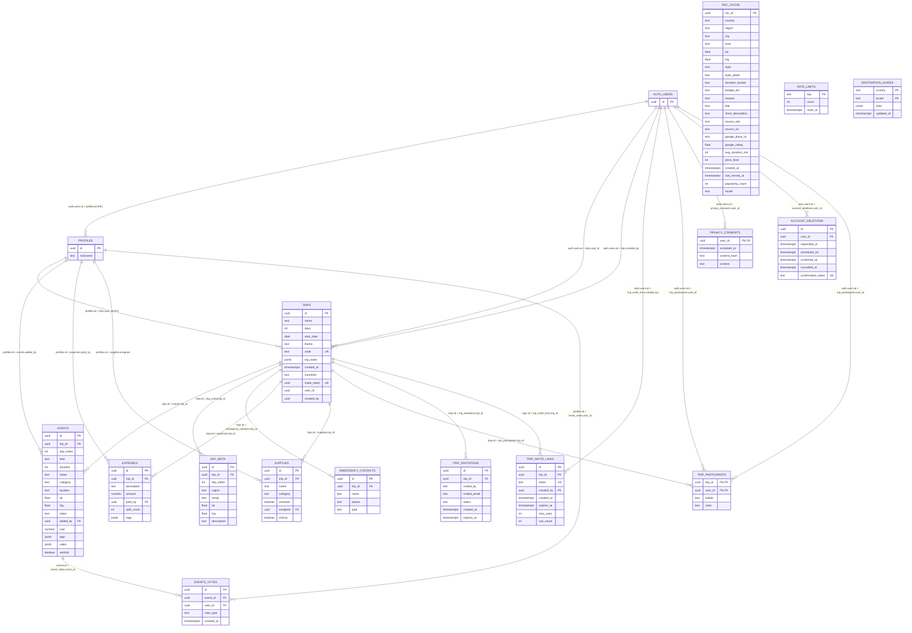

<div dir="rtl">

# Trippy — מתכנן טיולים קבוצתי חופשי

**פרויקט חי:** [letsexploring.com](https://letsexploring.com) | **GitHub:** (https://github.com/s61821333-ux/Trippy)

---

## סקירה כללית

**Trippy** היא אפליקציית Web (PWA) לתכנון טיולים קבוצתיים — לוח זמנים משותף, מפה אינטראקטיבית, תקציב קבוצתי ורשימת ציוד, הכל במקום אחד.  
מזמינים חברים בלחיצה אחת, ומתכננים ביחד בזמן אמת — ללא הורדת אפליקציה.

---

## הבעיה שהפרויקט פותר

כל מי שניסה לתכנן טיול עם קבוצה יכיר את הכאב:  
שיחות ווטסאפ שמתפצלות לתת-שרשורים, קובץ גוגל-שיטס לתקציב, מסמך גוגל-דוקס ללוח זמנים, ושמונה טאבים פתוחים ב-Booking.  
**אין מקום אחד שמחזיק את הכל יחד.**

כשמתכוננים לטיול, כל חבר קבוצה שם רעיונות במקום אחר, אף אחד לא יודע מה עלויות אמיתיות, ולוח הזמנים תמיד מפוצל בין כמה קבצים.  
Trippy פותר בדיוק את זה: מקום אחד, לכולם, עם AI שעוזר למלא את החסרים.

---

## קהל היעד

**מי:** קבוצות חברים (1-5 אנשים) שמתכננים טיול משותף — חופשת קיץ, טיול לחו"ל, נסיעת סיום.

**מתי משתמשים:** בשלב התכנון (שבועות לפני הנסיעה) ובמהלך הטיול עצמו — כשצריך לדעת מה הפעילות הבאה, כמה כסף נשאר, ומה לא לאבד.

**רמת מומחיות:** לא נדרש ידע טכני — ממשק עם ה-UX של אפליקציה נייטיבית, כניסה ביומטרית (Passkey), והצטרפות ללא הרשמה.

---

## מתחרים ובידול

| פתרון קיים | מה חסר בו |
|---|---|
| **ווטסאפ + גוגל-שיטס** | אין ויזואליזציה, אין מפה, אין חישוב חכם — פוזיציה בין 4 כלים |
| **TripIt / Sygic** | קורא אימיילים, לא לתכנון קבוצתי חי, ממשק מסורבל |
| **Wanderlog** | אנגלית בלבד, ממשק desktop-first, אין AI שמייצר מסלול שלם |
| **Google Trips (הופסק)** | כבר לא קיים |

**מה Trippy עושה אחרת:**

- **RTL + עברית מלאה** — היחיד שתוכנן מהתחלה לעברית וחוויה ימין-לשמאל
- **AI ברמת שאלות שטח** — Haiko עונה "מה לאכול בנאפולי ב-20 שקל" בהקשר הטיול הספציפי
- **PWA מותקנת** — אפליקציה ללא חנות אפליקציות, עובדת גם אופליין

---

## הרצה מקומית

```bash
git clone <repo-url>
cd trippy
npm install
cp .env.example .env.local   # מלאו את מפתחות Supabase + Anthropic
npm run dev
# → http://localhost:3000
```

### משתני סביבה ואינטגרציות חיצוניות

```env
# SUPABASE
NEXT_PUBLIC_SUPABASE_URL=
NEXT_PUBLIC_SUPABASE_ANON_KEY=
SUPABASE_SERVICE_ROLE_KEY=

# AI ASSISTANT
ANTHROPIC_API_KEY=

# GOOGLE CLOUDE FOR MAPS & SEARCH
NEXT_PUBLIC_GOOGLE_PLACES_KEY=

# LIVE DOMAIN
CLOUDFLARE_TURNSTILE_SECRET=
NEXT_PUBLIC_CLOUDFLARE_TURNSTILE_SITE_KEY=
```

---

## תרשים ERD — מודל הנתונים



> **הסבר קצר על הארכיטקטורה:**  
> `trips` הוא הישות המרכזית — הכל נקשר אליה. `profiles` מרחיב את `auth.users` של Supabase עם כינוי ואווטאר. `events` מחזיק גם פעילויות רגילות וגם פריטי Wishlist (דרך דגל `wishlist`). `rec_cache` ו-`destination_guides` הם טבלאות Cache לתשובות AI כדי לחסוך קריאות API חוזרות.

---

## שירותים חיצוניים ואינטגרציות

| שירות | סוג | תפקיד במוצר |
|---|---|---|
| **Supabase** | Backend-as-a-Service | Postgres DB, Auth (Passkeys/JWT), RLS, Storage |
| **Anthropic Claude** | AI API | יצירת מסלול, צ'אט Haiko, הצעות גאפ-פילר, סריקת קבלות, מאמן תקציב, מידע יעד |
| **Google CLOUDE API** |  API | להצגת מפות ולכניסה דרך גוגל  Autocomplete לחיפוש מיקומים בהוספת אירוע |
| **Cloudflare Turnstile** | CAPTCHA | הגנת Bot בכניסה עם Passkey |
| **Weather API** | מזג אוויר | תחזית לכל ימי הטיול לפי מיקום |
| **Exchange Rates API** | פיננסי | המרת מטבע בזמן אמת לתקציב |
| **Vercel** | Deploy | אחסון ו-Edge Functions |

---

## פיצ'רים עיקריים

| פיצ'ר | תיאור |
|---|---|
| **לוח זמנים יומי** | ציר זמן לכל יום עם גרירה, קטגוריות, זמן נסיעה |
| **Haiko AI** | צאטבוט + גילוי מקומות חדשים ע"י סריקה במדריכי טיולים פופולארים באינטרנט |
| **תקציב קבוצתי** | מעקב הוצאות, תגיות, המרת מטבע, מחשבון התחשבנות |
| **מפה** | כל הנקודות ממוקמות עם מסלול ואומדן זמן נסיעה |
| **Wishlist** | שמירת רעיונות לפני הכנסתם ללוח הזמנים |
| **ציוד (Packing)** | רשימה קבוצתית עם שיוך לחברים |
| **מלונות** | לינה לכל יום, מחיר נכנס לתקציב |
| **הצטרפות מהירה** | לינק ייחודי + קוד סודי (SHA-256), ללא הרשמה לצפייה |
| **RTL + עברית** | תמיכה מלאה, כולל ריבוי חכם |

---

## סטאק טכנולוגי

| שכבה | טכנולוגיה |
|---|---|
| Framework | Next.js 16 (App Router) |
| UI | React 19, Tailwind CSS 4, Framer Motion |
| Auth + DB | Supabase (Postgres, RLS, Passkeys) |
| AI | Anthropic Claude |
| Maps | Leaflet + React Leaflet |
| State | Zustand |
| Validation | Zod |
| Testing | Playwright |
| Deploy | Vercel |

</div>
