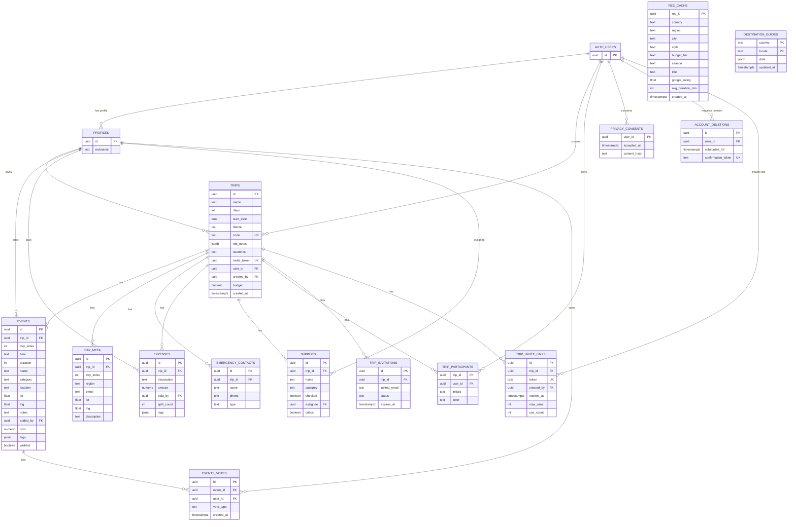

# Trippy — Group Trip Planner

**Live Project:** [letsexploring.com](https://letsexploring.com) &nbsp;|&nbsp; **GitHub:** [github.com/s61821333-ux/Trippy](https://github.com/s61821333-ux/Trippy)

> **Live trip demo invite:**
> [letsexploring.com/join/7324c...](https://letsexploring.com/join/7324c133399b3bc37deca381ed9e96cd9a63ed44754477371239397e681a8f06)

---

## What is Trippy?

**Trippy** is the one-stop shop for planning group trips — daily itinerary, interactive map, shared budget, and packing list, all synced in real time across the whole group. Built for experienced trip organizers who are tired of juggling 6 tools at once. An AI suggests you new places to explore from blogs and a chatbot will helps you anytime .

---

## Screenshots

<table>
  <tr>
    <td align="center">
      <br/>
      <b>Dashboard</b><br/>
      <sub>Trip overview — countdown, weather forecast per day, budget gauge, and next activity at a glance</sub>
    </td>
    <td align="center">
      <br/>
      <b>Daily Itinerary</b><br/>
      <sub>Timeline view per day with activity cards, categories, hotel checkout, and time blocks</sub>
    </td>
  </tr>
  <tr>
    <td align="center">
      <br/>
      <b>Interactive Map</b><br/>
      <sub>All trip points plotted on a live map with day budget and weather shown inline</sub>
    </td>
    <td align="center">
      <br/>
      <b>Packing List</b><br/>
      <sub>Group packing list organized by category (Gear, Documents, Health, Food) with AI-generated suggestions</sub>
    </td>
  </tr>
  <tr>
    <td align="center">
      <br/>
      <b>Haiko AI — Mood Picker</b><br/>
      <sub>AI discovery flow: pick a vibe, refine by sub-category, set location, duration, and budget — then find spots</sub>
    </td>
    <td align="center">
      <br/>
      <b>Haiko AI — Spot Results</b><br/>
      <sub>AI-curated local spots with ratings, price level, and one-tap "Add to day plan" or Wishlist</sub>
    </td>
  </tr>
</table>

---

## The Problem

Anyone who has planned a trip for a group knows the drill: open Google Docs for the itinerary, Google Sheets for the budget, Booking for accommodations, TripAdvisor for recommendations, Google Maps for navigation, and WhatsApp to coordinate — then try to keep all of them up to date simultaneously.

**The organizer's pain:**
- Hours building an itinerary in Docs that nobody reads
- A budget spreadsheet updated manually after every expense
- "Who paid for dinner?" — asked 20 times a day
- On the ground: the itinerary in one link, the map in another, nobody knows what's next

**The solution:** Trippy replaces all of these with one experience, synced to the whole group in real time, that works offline too.

---

## Target Audience

### Primary Persona: "The Organizer"

Someone experienced with travel who takes ownership of the planning process and knows the pain well — because they do it over and over with a pile of tools that don't talk to each other.

**Profile:**
- Age 22–40, has traveled abroad at least 2–3 times
- Already comfortable with Booking, TripAdvisor, Google Maps — and looking to consolidate them into one place
- Spends hours building a Google Docs itinerary and Sheets budget, sends it to the group on WhatsApp, then loses control

**Usage context:** Weeks before the trip (planning) + on the ground (real-time management)

### Secondary Persona: "The Participant"

A group member who isn't planning but wants to see what's happening, add wishes, and track expenses — joins via a link, no registration required.

**Technical skill required:** Zero, for both personas. Sign in with Google SSO or a passkey; read-only access with no account at all.

---

## Competitor Analysis & Differentiation

| Existing Solution | Core Weakness | What Trippy Does Differently |
|---|---|---|
| **WhatsApp + Google Sheets** | 4 separate tools, no visualization, no map, no debt calculation | One place — itinerary + budget + map + packing list |
| **Wanderlog** | English only, desktop-first, no true real-time collaboration | Full RTL support, mobile-first, real-time sync for the whole group |
| **TripIt** | Reads emails only, not for active planning, clunky UI | Active planning with AI that builds a full itinerary from scratch by budget and style |
| **Notion / Airtable** | Generic tool, no map, no debt calculator, no RTL | Domain-specific: every feature is built for the travel use case |
| **"Just do it manually"** | Hours of work, scattered info, calculation errors | Full itinerary generated in 30 seconds with Claude AI |

**3 Unique Advantages:**

1. **RTL + Hebrew from the ground up** — the only app designed for the Israeli market; proper pluralization, full text directionality, and UI components built RTL, not flipped
2. **AI with full trip context** — Haiko (Claude) knows "what to eat in Naples for ₪50" because it receives the destination, dates, budget, and current itinerary — not just a generic prompt
3. **PWA without an app store** — installs directly from the browser, works offline, supports push notifications — native app experience without the friction of downloading

---

## Core Features

| Feature | Description |
|---|---|
| **Daily Itinerary** | Timeline per day — drag & drop, categories, automatic travel time |
| **Haiko AI** | Full itinerary from one sentence; context-aware chat; Gap-Filler for empty time slots |
| **Group Budget** | Expense tracking by tags, real-time currency conversion, "who owes whom" calculator |
| **Interactive Map** | All points plotted, daily route, travel time estimates |
| **Wishlist** | Parking lot for ideas before adding them to the itinerary — group voting |
| **Packing List** | Group list with personal assignment, "critical" flag |
| **Hotels** | Accommodation per day, price flows automatically into budget |
| **Quick Join** | Unique link + SHA-256 code; read-only access without registration |
| **Offline-Ready** | Service Worker — itinerary accessible with no signal |

---

## Technical Architecture

```
Browser (PWA + Service Worker)
    │
    ├── Next.js 16 App Router (Vercel Edge)
    │       ├── /app        — pages and React 19 components
    │       ├── /api        — server-side proxy (API keys never reach the client)
    │       └── Zustand     — global state management
    │
    ├── Supabase
    │       ├── PostgreSQL  — primary database
    │       ├── RLS         — Row-Level Security: users see only their own trips
    │       ├── Auth        — Passkeys / Google OAuth / Magic Link
    │       └── Realtime    — instant sync to all participants
    │
    └── External APIs  ← all routed through server-side; no key exposed in bundle
            ├── Anthropic Claude   — AI itinerary + Haiko chat
            ├── Google Maps/Places — map + autocomplete
            ├── OpenWeather        — forecast for every trip day
            └── Exchange Rates     — real-time currency conversion
```

**Security:** RLS enforced on every table — even with direct DB access, a user cannot see data from trips they don't belong to. All API keys live in server-side routes and are never shipped in the client bundle.

---

## ERD — Data Model



> `trips` is the central entity — everything links to it.
> `profiles` extends Supabase's `auth.users` with a nickname and avatar.
> `events` holds both regular activities and Wishlist items via the `wishlist` flag.
> `rec_cache` + `destination_guides` cache AI responses to avoid repeated API calls.
> RLS is active on all tables.

---

## External Services & Integrations

| Service | Type | Role in Product | Security |
|---|---|---|---|
| **Supabase** | BaaS | PostgreSQL, Auth (Passkeys/OAuth/Magic Link), RLS, Realtime | Server-side |
| **Anthropic Claude** | AI API | Itinerary generation, Haiko chat, Gap-Filler, receipt scanning | Server-side proxy — key never exposed to client |
| **Google Maps API** | Mapping | Interactive map, daily route | Domain-restricted key |
| **Google Places API** | Search | Autocomplete for location search when adding events | Domain-restricted key |
| **Google OAuth** | Authentication | Sign in with Google account | OAuth 2.0 / Supabase provider |
| **OpenWeather API** | Weather | Forecast for every trip day by location | Server-side proxy |
| **Exchange Rates API** | Finance | Real-time currency conversion for budget | Server-side proxy |
| **Vercel** | Deploy + Edge | Hosting, CDN, Edge Functions | — |

---

## Tech Stack

| Layer | Technology |
|---|---|
| Framework | Next.js 16 (App Router) |
| UI | React 19, Tailwind CSS 4, Framer Motion |
| Auth + DB | Supabase (Postgres, RLS, Passkeys, Realtime) |
| AI | Anthropic Claude (Haiku) |
| Maps | Leaflet + React Leaflet |
| State | Zustand |
| Validation | Zod |
| Testing | Playwright |
| Deploy | Vercel |

---

## Local Setup

```bash
git clone https://github.com/s61821333-ux/Trippy.git
cd Trippy
npm install
cp .env.example .env.local   # fill in keys (see list below)
npm run dev
# → http://localhost:3000
```

**Required environment variables:**

```
NEXT_PUBLIC_SUPABASE_URL=
NEXT_PUBLIC_SUPABASE_ANON_KEY=
ANTHROPIC_API_KEY=          # server-side only
GOOGLE_MAPS_API_KEY=
OPENWEATHER_API_KEY=
EXCHANGE_RATES_API_KEY=
```

---

## Development Process — Vibe Coding with AI

This project was built using **Vibe Coding**: continuous use of Claude Code (Anthropic) throughout the entire development cycle — not just for code completion, but as a pair programmer at every stage.

| Stage | AI Usage |
|---|---|
| **Architecture** | ERD design, table structure, RLS policy planning |
| **Features** | React component generation, API routes, Supabase queries |
| **Security** | RLS policy analysis, exposure checks, hardening |
| **Design** | CSS tokens, Tailwind, Framer Motion animations |
| **Debugging** | Async error analysis, edge case fixes, performance |

**Key takeaway:** AI accelerates development but doesn't replace understanding — every suggestion gets reviewed, especially around security (RLS) and async patterns in Next.js. The most valuable skill: describing a **problem** to the AI, not asking for a specific **solution**.
